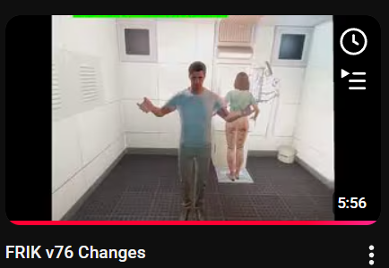
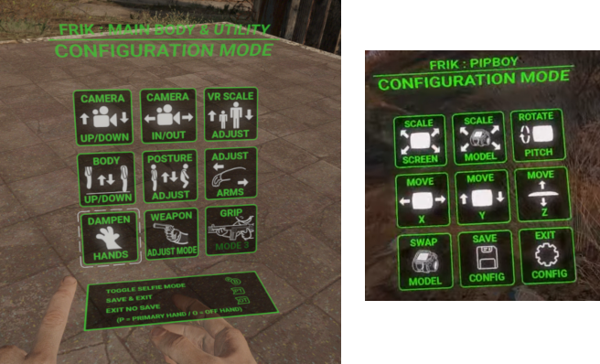

See the first part of this video:

---

> This screenshot needs to be updated.

Check the video: https://www.youtube.com/watch?v=-ckofGjqbhY

## Main Configuration Mode
Press and hold both the `Sprint` and `Favorites` buttons until the UI is shown.

### Play Seated Mode
- Toggle this if you are playing seated for the best body position.

### HMD and Body Configuration
- Configure the HMD/body up/down offset and body in/out offset.

### Weapon Grip Modes
- Mode 1: The hand automatically snaps to the barrel when in range; move your hand quickly to let go.
- Mode 2: The hand automatically snaps to the barrel when in range; press the grip button to let go.
- Mode 3: Hold the grip button to snap to the barrel; release it to let go.
- Mode 4: Press the grip button to snap to the barrel; press it again to let go.

## Pip-Boy Configuration Mode
- **Activation**: Press and hold the `Favorites` button with the Pip-Boy open
- **To Cancel Changes**: Exit the Pip-Boy without using the UI
- **To Save Changes**: Use the UI save button

### Wrist-Based Pip-Boy On/Off Improvements
- **Quick Access**: Press left trigger to open the Pip-Boy
- **Torch Control**: Hold trigger to toggle the torch (similar to Projected Pip-Boy mode).

### Switch Between Pip-Boy Models
- Access via **Pip-Boy Config Mode**.
- Toggle between **Standard** and **HoloPipboy** models.

### New Pip-Boy NIF
- Supports **interchangeable** standard and holo Pip-Boys.
- Includes interactive elements: **switches, buttons, and dials**.
- Designed for new visual improvements.

### Torch & Radio Virtual Buttons
- **Note**: The Pip-Boy must be **off** to use these features.
- Use virtual buttons to toggle **torch** and **radio**

### Interactive Pip-Boy UI Controls
- Must have **wrist-based Pip-Boy** enabled in-game.
- The game window must be **in focus**.
- Control the Pip-Boy with your **primary index finger**.

### Primary-Hand Pip-Boy Controls
- Navigate menus with **right stick / trigger**.
- Switch main tabs using **face buttons** on the **secondary controller**.

### Torch Mode Switching (Head vs. Hand Based)
- Activate the torch  
- Raise the secondary controller to the **top of your head**.
- When you feel **continuous rumble**, press **grip** to switch mode.

### Auto Hand Posture for Pip-Boy Usage
- The hand automatically **points** when it is in range of the Pip-Boy and you are looking at the screen.
- The hand returns to normal when **out of range**.
