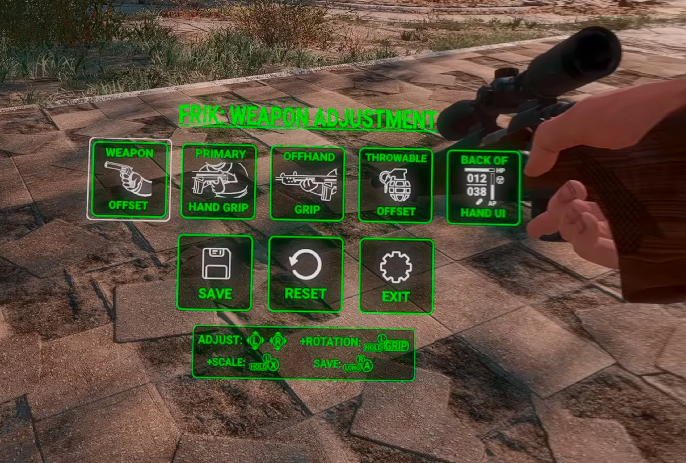
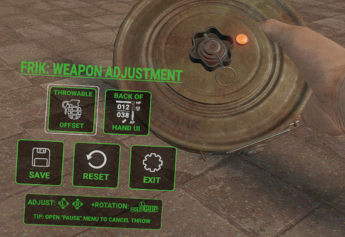
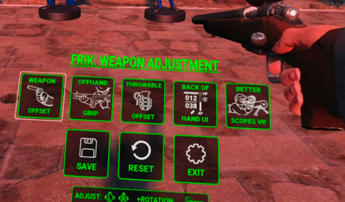

## Defaults
FRIK ships with 160+ embedded pre-created offset files covering vanilla weapons (including throwables) in right-handed mode.  
It should work for most players, but changing VR scale or other settings can cause misalignment. This is what Weapon Adjustment config is for.
Note: See the "Resetting" behavior.

## Enable Adjustment Config

1. Select "Weapon Adjustment" mode in [main config mode](in-game-configuration-guide.md).
2. Toggle "Weapon Adjustment" mode in FRIK Settings holotape.

When in config mode, both controller thumbsticks are disabled to prevent movement.
The primary controller thumbstick (right for right-handed mode) controls the horizontal axes (right/left, forward/backward); the secondary controller controls the vertical axis (up/down).
To control rotation, hold the secondary controller grip button. Both thumbsticks will switch to rotation mode.

### Saving
Adjustments are only saved when you explicitly request a save via button or shortcut. When exiting adjustment mode or switching weapons, the weapon position offsets are reloaded from the last saved configuration.

### Resetting
Resetting weapon adjustment deletes the saved offset config and loads the game's default state. If the weapon has an embedded default, it will not reset to it while adjustment config mode is open. If no custom adjustment is saved, the weapon will reset to the embedded default when exiting config mode or switching weapons. If you do not want to use the embedded default, save after resetting to override the offset config.

## File Location

All saved files are in `%USERPROFILE%\Documents\My Games\Fallout4VR\FRIK_Config\Weapons_Offsets`.
There can be multiple variants per weapon, and the files can be shared with others.

File names follow the pattern `<WeaponName>[-<mode>][-PowerArmor][-leftHanded].json`, combining a mode segment with optional Power Armor and left-handed segments:

| Mode segment | Meaning |
| --- | --- |
| _(none)_ | Primary weapon grip offset. |
| `-primHand` | Primary-hand offset (improves rifle-type weapons). |
| `-offHand` | Offhand two-handed grip offset. |
| `-throwable` | Throwable weapon offset. |
| `-backOfHand` | Back-of-hand UI offset. |

For example: `Pipe Gun.json`, `Pipe Gun-PowerArmor.json`, `Pipe Gun-leftHanded.json`, `Pipe Gun-offHand-PowerArmor-leftHanded.json`, and `Pipe Gun-backOfHand.json`.

For back-of-hand UI, there is an additional `EmptyHand` "weapon" that is used as a global offset if no weapon-specific offset is found. You can adjust it in weapon adjustment config mode by unequipping a weapon and switching to back-of-hand adjustment in the UI.

## Throwable Weapon

Throwable weapon adjustment requires you to prime the throwable and *keep holding it* while using the thumbsticks to adjust. This is because the throwable weapon game object only exists while primed and is removed as soon as it is released.

TIP: To cancel throwing the throwable weapon, keep holding it, open either the pause menu or Pip-Boy, and then release the throwable. This closes the menu and cancels the throw.

## Offhand Grip

Use this mode to change the X/Z axis (right/left, up/down in the world) where your offhand grabs the weapon. This is useful for weapons with larger stocks.
There is a known issue with the primary hand being "dislodged" from the weapon grip. This is caused by the weapon's center point being away from the grip, so rotation moves the grip away from the hand.

## Back-of-Hand UI
This is the UI that shows HP, AP, ammo, effects, etc.
There are hardcoded defaults for in/out of power armor and right/left-handed modes that should work regardless of the equipped weapon.
If they do not, you can adjust the back-of-hand UI globally and for each weapon.
Unequip a weapon to adjust the global back-of-hand UI offsets. This creates an `EmptyHand-backOfHand` offset JSON file.

## Better Scopes VR

The config mode supports scope reticle repositioning if you have the BetterScopesVR mod installed.
Scopes may need to be calibrated so the reticles are true to the impact.

*Scope Zoom Toggling*
Scope zooms can be adjusted from lower magnitudes up to the scope's maximum defined zoom. The steps are defined in Better Scopes VR's ini `ZoomValues`. The defaults are `2.5,4.0,8.0`.
